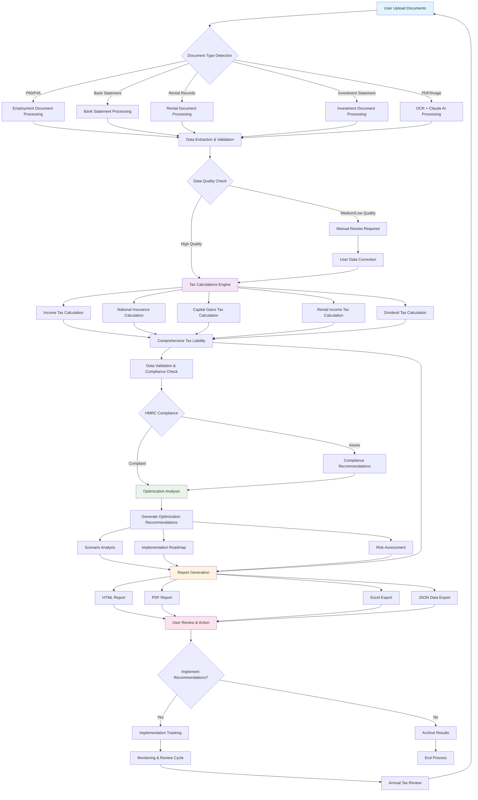

# Tax Optimization AI - System Workflow Flowchart
**Date:** 08-09-2025  
**Version:** 1.0  
**Authored by:** Sotiris Spyrou, CEO, VerityAI  
**File Path:** //documents/Workflow_Flowchart_08092025.md

## System Architecture Flow

## Process Flow Explanation

### **Phase 1: Document Ingestion & Processing**
1. **Document Upload**: Users upload tax documents (P60, P45, bank statements, etc.)
2. **Type Detection**: System automatically identifies document types
3. **Data Extraction**: Specialized processors extract relevant financial data
4. **Quality Assessment**: Confidence scoring and validation of extracted data

### **Phase 2: Tax Calculation Engine**
1. **Data Validation**: Comprehensive validation of input data
2. **Multi-Stream Calculation**: Parallel processing of different tax types
3. **Integration**: Consolidation of all tax calculations
4. **Compliance Check**: HMRC rules validation and compliance verification

### **Phase 3: Optimization Analysis**
1. **Opportunity Identification**: Analysis of tax optimization opportunities
2. **Scenario Modeling**: Multiple optimization scenarios with risk assessment
3. **Prioritization**: Ranking recommendations by impact and feasibility
4. **Implementation Planning**: Detailed roadmap with timelines and requirements

### **Phase 4: Report Generation & Delivery**
1. **Multi-Format Reports**: HTML, PDF, Excel, and JSON outputs
2. **Executive Summary**: High-level insights and key recommendations
3. **Detailed Analysis**: Comprehensive breakdown and supporting data
4. **Action Plans**: Specific next steps and implementation guidance

### **Phase 5: Implementation & Monitoring**
1. **User Review**: Decision on recommendation implementation
2. **Progress Tracking**: Monitoring of implemented strategies
3. **Periodic Review**: Annual review cycle for continuous optimization

## Key Decision Points

### **Data Quality Checkpoints**
- **High Quality (>90% confidence)**: Proceed automatically
- **Medium Quality (70-90% confidence)**: Flag for user review
- **Low Quality (<70% confidence)**: Require manual intervention

### **Compliance Validation**
- **HMRC Rule Compliance**: Automatic validation against current regulations
- **Risk Assessment**: Evaluation of optimization strategy risks
- **Professional Advice Triggers**: Identification of complex scenarios requiring expert input

### **Optimization Thresholds**
- **Immediate Actions**: Savings >£1,000 with <30 days implementation
- **Strategic Planning**: Multi-year optimizations >£5,000 annual benefit
- **Professional Review**: Complex strategies requiring advisor consultation

## Error Handling & Recovery

### **Document Processing Errors**
- **OCR Failures**: Fallback to manual data entry with guided forms
- **Format Issues**: Alternative processing methods or user assistance
- **Missing Data**: Clear identification of required additional documentation

### **Calculation Errors**
- **Input Validation**: Pre-calculation data verification
- **Cross-Checking**: Multiple validation methods for accuracy
- **Audit Trail**: Complete calculation methodology documentation

### **System Failures**
- **Graceful Degradation**: Core functionality maintained during partial failures
- **Data Persistence**: Automatic saving of progress at each stage
- **Recovery Procedures**: Clear restart and continuation protocols

## Integration Points

### **External Services**
- **Claude AI API**: Advanced document processing and analysis
- **HMRC APIs**: Real-time compliance checking (future enhancement)
- **Banking APIs**: Direct transaction import (future enhancement)

### **Internal Modules**
- **Document Processor ↔ Tax Calculator**: Structured data exchange
- **Tax Calculator ↔ Optimization Engine**: Complete tax position analysis
- **Optimization Engine ↔ Report Generator**: Recommendation formatting
- **All Modules ↔ Validation Engine**: Continuous quality assurance

## Performance Metrics

### **Processing Speed**
- **Document Processing**: <30 seconds per document
- **Tax Calculations**: <5 seconds for complete analysis
- **Report Generation**: <10 seconds for all formats

### **Accuracy Targets**
- **Data Extraction**: >95% accuracy for high-quality documents
- **Tax Calculations**: 100% accuracy for standard scenarios
- **Optimization Recommendations**: >90% implementation success rate

### **User Experience**
- **End-to-End Processing**: <2 minutes from upload to report
- **User Intervention**: <5% of cases requiring manual input
- **Satisfaction**: Target >4.5/5 user rating

This flowchart provides a comprehensive visual guide for understanding the Tax Optimization AI workflow, suitable for both technical implementation and user communication.
